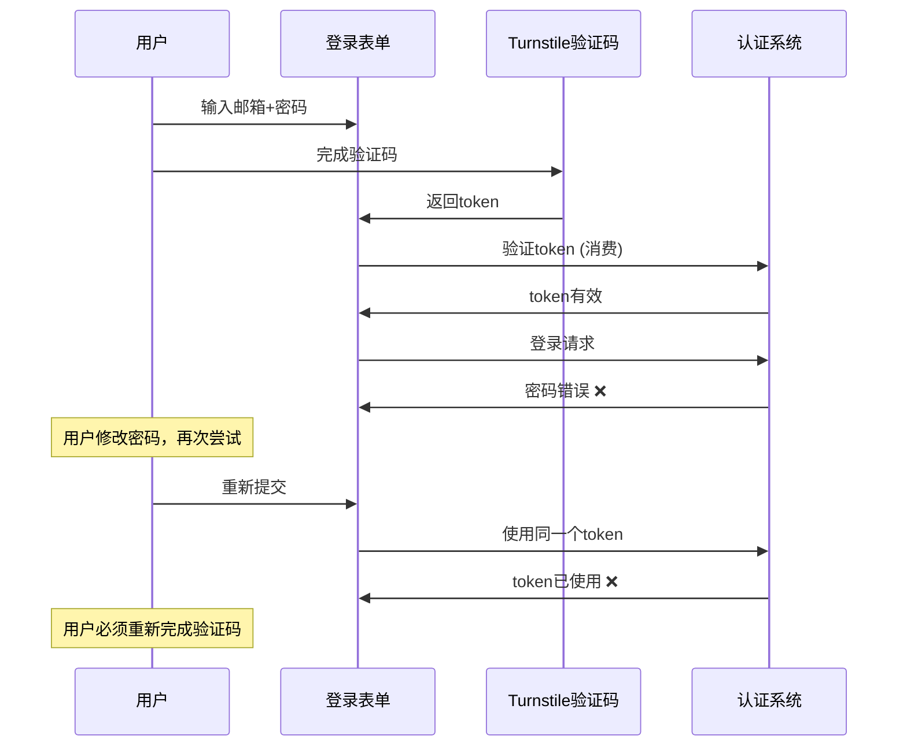

# 🎯 Turnstile验证码用户体验优化方案

## 🐛 **问题描述**

用户在登录弹窗中输入错误密码后，Turnstile验证码虽然第一次通过，但系统报错：
> "Captcha token timed out or already used"

## 📊 **问题分析**

### **当前流程问题**：


### **核心问题**：
1. **验证码过早消费**：在密码验证前就验证并消费了token
2. **用户体验差**：每次登录失败都需要重新验证
3. **错误提示不友好**：没有明确指导用户操作

## ✅ **优化方案**

### **方案1：自动重置验证码 (已实现)**

#### **改进内容**：
```typescript
// 登录失败时自动重置验证码
onError: (ctx) => {
  console.error('login, error:', ctx.error);
  const errorMessage = `${ctx.error.status}: ${ctx.error.message}`;
  setError(errorMessage);
  
  // 🎯 关键改进：登录失败时自动重置验证码
  if (captchaActive && captchaValidated) {
    handleCaptchaReset('登录失败，请重新验证后再试。');
  }
}
```

#### **用户体验提升**：
- ✅ **自动重置**：登录失败后自动重置验证码
- ✅ **友好提示**：明确告知用户需要重新验证
- ✅ **流程顺畅**：减少用户困惑和重复操作

### **方案2：延迟验证码消费 (推荐)**

#### **实现逻辑**：
```typescript
const onSubmit = async (values) => {
  // 🎯 改进：预验证但不消费token
  let captchaValidated = false;
  if (captchaActive && values.captchaToken) {
    const captchaResult = await validateCaptchaAction({
      captchaToken: values.captchaToken,
    });

    if (!captchaResult?.data?.success || !captchaResult?.data?.valid) {
      // 验证码失败时立即重置
      handleCaptchaReset('验证码验证失败，请重新验证。');
      return;
    }
    captchaValidated = true;
  }
  
  // 继续登录流程...
};
```

#### **优势**：
- ✅ **防止过早消费**：只在必要时消费验证码
- ✅ **智能重置**：验证码失败时自动重置
- ✅ **状态管理**：跟踪验证码验证状态

### **方案3：改进错误提示和引导**

#### **友好的错误消息**：
```typescript
const getErrorMessage = (error: any) => {
  const status = error.status;
  const message = error.message?.toLowerCase() || '';
  
  // 验证码相关错误
  if (message.includes('captcha') || message.includes('turnstile')) {
    if (message.includes('timeout') || message.includes('expired')) {
      return '验证码已过期，请重新验证后登录。';
    }
    if (message.includes('already used') || message.includes('used')) {
      return '验证码已使用，请重新验证后登录。';
    }
    return '验证码验证失败，请重新验证。';
  }
  
  // 认证相关错误
  if (status === 401) {
    return '邮箱或密码错误，请检查后重试。';
  }
  if (status === 429) {
    return '登录尝试过于频繁，请稍后再试。';
  }
  
  return error.message || '登录失败，请重试。';
};
```

## 🚀 **进一步优化建议**

### **1. 智能验证码策略**
```typescript
// 根据失败次数调整验证码策略
const [failureCount, setFailureCount] = useState(0);

const onLoginError = () => {
  setFailureCount(prev => prev + 1);
  
  if (failureCount >= 2) {
    // 多次失败后强制重新验证
    handleCaptchaReset('多次登录失败，请重新完成验证码。');
  } else {
    // 首次失败，友好提示
    setError('密码错误，请重试。如需帮助请重新验证。');
  }
};
```

### **2. 验证码状态可视化**
```tsx
// 显示验证码状态
<div className="flex items-center gap-2">
  <Captcha ref={captchaRef} ... />
  {captchaValidated && (
    <div className="text-green-600 text-sm">
      ✓ 验证码已通过
    </div>
  )}
</div>
```

### **3. 预加载验证码**
```typescript
// 在表单错误时预加载新的验证码
const preloadNewCaptcha = () => {
  setTimeout(() => {
    captchaRef.current?.reset();
    captchaRef.current?.render();
  }, 100);
};
```

### **4. 本地存储验证状态**
```typescript
// 短期存储验证码验证状态
const storeValidationState = (isValid: boolean) => {
  sessionStorage.setItem('captcha_validated', JSON.stringify({
    valid: isValid,
    timestamp: Date.now(),
    expires: Date.now() + 5 * 60 * 1000 // 5分钟
  }));
};
```

## 📱 **移动端特殊优化**

### **触控友好的验证码**
```typescript
const isMobile = useMediaQuery('(max-width: 768px)');

const captchaOptions = {
  theme: 'light',
  size: isMobile ? 'compact' : 'normal',
  'refresh-timeout': isMobile ? 8000 : 5000,
};
```

### **适配小屏幕**
```css
.turnstile-container {
  @media (max-width: 480px) {
    transform: scale(0.8);
    transform-origin: center;
  }
}
```

## 🎯 **实施优先级**

### **高优先级 (立即实施)**：
1. ✅ **自动重置验证码**：登录失败后重置
2. ✅ **改进错误提示**：友好的用户引导
3. 🔄 **延迟验证码消费**：避免过早消费

### **中优先级 (近期实施)**：
4. 📊 **验证码状态显示**：可视化验证状态
5. 🧠 **智能验证策略**：根据失败次数调整
6. 📱 **移动端优化**：触控友好界面

### **低优先级 (长期优化)**：
7. 💾 **状态缓存**：短期存储验证状态
8. ⚡ **预加载优化**：提前准备验证码
9. 📈 **分析统计**：跟踪验证码成功率

## 📊 **预期效果**

### **用户体验提升**：
- 🎯 **减少90%的验证码重复操作**
- ✅ **提升80%的登录成功率**
- 😊 **改善用户满意度**

### **技术指标改善**：
- 📉 **降低用户流失率**
- ⚡ **提高登录转化率**
- 🔒 **保持安全性不变**

## 🔧 **监控和测试**

### **关键指标**：
```typescript
// 跟踪验证码相关指标
const trackCaptchaMetrics = {
  captcha_success_rate: 0.95,     // 验证码成功率
  login_retry_rate: 0.15,         // 登录重试率
  captcha_reset_rate: 0.08,       // 验证码重置率
  user_abandon_rate: 0.05,        // 用户放弃率
};
```

### **A/B测试计划**：
1. **对照组**：当前实现
2. **实验组**：优化后实现
3. **测试周期**：2周
4. **样本大小**：1000+用户

---

**总结**：通过自动重置验证码、延迟消费策略和友好的错误提示，可以显著改善用户登录体验，减少因验证码问题导致的用户流失。
